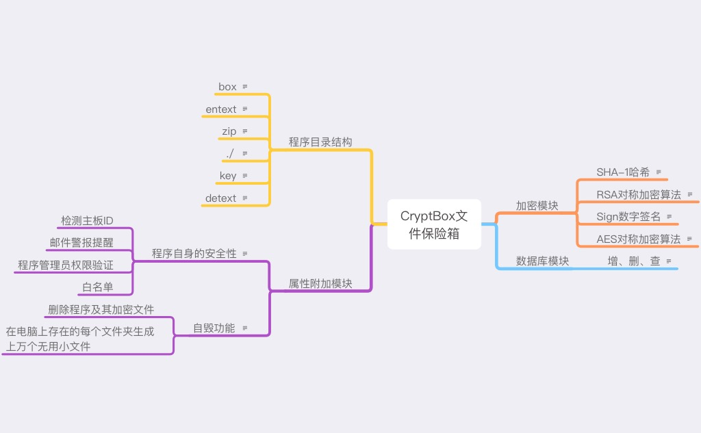

# CryptBox

##  一、现实生活保险箱的特点
        1、保险箱自身坚固，难以破坏
    	2、加密复杂多样
    	3、有各种保险方式，如在某些极端情况下保护（破坏）保密文件
    	4、防盗警报

## 二、数据安全思想依据
       访问控制、加密、数据完整及不可否认性。

## 三、程序功能设计
	1、有一个加密的模块，其中包含了 AES、RSA、SHA-1等加密验证
	2、程序本身的安全性，以及如何处理极端情况下的文件保密性
	3、加密文件处理
	4、白名单验证

## 四、程序实现逻辑
​		

​	加密解密：
​	AES算法使用box.key里的密钥加密源文件，而box.key文件里的密钥可由用户自定义或随机密钥，SHA256计算	box.key的哈希值，RSA公钥加密box.key ，私钥签名加密后的box.key文件。

功能逻辑实现：

## 五、构建“箱子”

	1、使用软件前，检测到目录下是否存在**box.key**这个文件(保险箱钥匙)，如果存在则检验是否是本保险箱的钥匙，是则开始验证用户名及其密码，再检测软件所在主板ID是否在白名单里，不在则启动负面效果，如果box.key不在软件则无法启动。
	
	2、在软件成功启动后进入功能选择区，有如下选项：a存放(加密)文件，b取出(解密)文件（保险箱嘛，功能就是保存文件到文件夹）
	
	3、如果是打算选择取出文件的话，**box.key**、**Whitelist.xml**，在key文件夹里需要存在**privkey.key**并尝试解密box.key，如果失败的话会直接退出程序。
